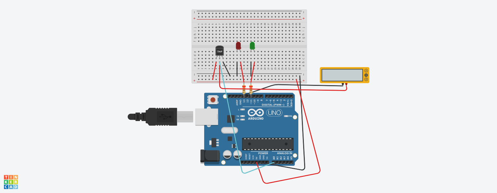

# projetos-arduino
Projetos e circuitos de eletrónica/Arduino desenvolvidos no Tinkercad para Engenharia Eletrotécnica e de Computadores.

## Projeto 1: Monitorização de temperatura com TMP36.

Sistema de leitura de temperatura ambiente com alerta luminoso via LEDs.

### Componentes
*Arduino Uno
*Sensor de Temperatura Analógico (TMP36)
*2x LEDs (Verde e Vermelho)
*2x Resistores (220 Ω)
*Multímetro Virtual

### Circuito Montado

Funcionamento
* O Arduino lê a tensão do pino 'A0' vinda do TMP36 e converte-a para graus Celsius
* Se a temperatura for **superior a 25°C**, acende **LED vermelho** (alerta)
* Se a temperatura for **inferior ou igual a 25°C**, acende **LED verde** (normal)

